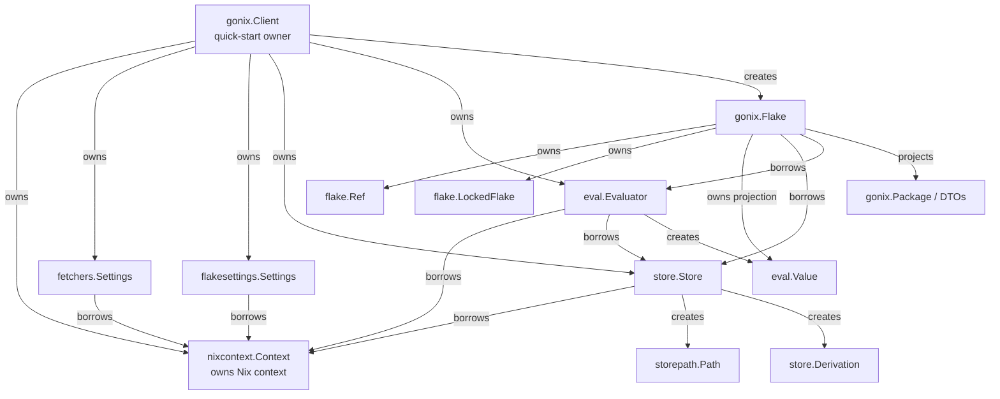

# gonix architecture

`gonix` is a high-level Go SDK over
`github.com/sund3RRR/nix-go-bindings`, the generated bridge to the public Nix C
API.

The SDK has two entry layers:

- `gonix.Client` is the quick-start, flake-first API.
- `nixcontext.Context` plus the public subpackages are the composable advanced
  API.

## Boundary with nix-go-bindings

`nix-go-bindings` is the only gateway to Nix. Gonix must not duplicate
generated bindings, call private Nix C++ APIs, add ad hoc cgo, or shell out to
the `nix` CLI for core SDK behavior.

Raw generated context pointers never cross public constructor boundaries.
Public constructors receive `*nixcontext.Context`. Narrow integration points
may still accept or return another raw generated handle when wrapping an
already-owned Nix object, for example `storepath.New` and `Value.Borrow`.

Every owned wrapper uses the API-specific lifecycle operation:
`StoreFree`, `StorePathFree`, `DerivationFree`, `StateFree`, `ValueDecref`,
`FlakeReferenceFree`, `LockedFlakeFree`, and corresponding settings free
functions. Generated `.Free()` helpers are not a substitute for object-specific
lifecycle APIs.

## Entrypoint model

### Client quick start

`Client` is the primary user-facing object:

```go
client, err := gonix.NewClient(gonix.ClientConfig{})
defer client.Close()

f, err := client.NewFlake("github:NixOS/nixpkgs/nixos-unstable")
defer f.Close()

var name string
err = f.Output([]string{"packages", gonix.DefaultSystem(), "hello", "name"}, &name)

pkg, err := f.FetchPackage("hello")
outputs, err := f.RealizePackage(pkg)

var result int
err = client.Eval("1 + 2", &result)
```

`ClientConfig{}` is flake-ready. It preserves Nix defaults while enabling
`nix-command` and `flakes` when the caller did not explicitly configure
`experimental-features`.

Client owns:

- one hidden `nixcontext.Context`;
- fetcher and flake settings;
- one default Store and Evaluator.

Every Flake returned by `Client.NewFlake` is caller-owned and must be closed
before the Client. Client closes its evaluator, store, settings, and context in
reverse dependency order.

`Client.Eval` is the resource-safe convenience path for evaluating a Nix
expression directly into Go data. Advanced callers that need raw values or a
custom diagnostic path use `eval.Evaluator`.

`Flake.Output` provides the corresponding resource-safe path for decoding any
locked flake output. Attribute paths are represented as string slices so every
element names one exact Nix attribute without parsing or escaping rules.

### Advanced composition

Advanced users create an explicit lifetime root and compose subpackages:

```go
ctx, err := nixcontext.New(nixcontext.Config{})
defer ctx.Close()

s, err := store.New(ctx, "dummy://")
defer s.Close()

e, err := eval.New(ctx, s)
defer e.Close()
```

`nixcontext.Context` creates and initializes libutil, libstore, and libexpr. It
owns only the raw Nix context and does not track children. Every child must be
closed before its Context.

The root `gonix.NewFlake` constructor is an advanced composition point. Its
Context, settings, Store, and Evaluator arguments are borrowed, must belong to
the same object graph, and must outlive the returned Flake.

Lock metadata is not exposed yet. The public libflake C API can return evaluated
outputs from a locked flake but cannot inspect its resolved reference or lock
graph. Gonix does not reconstruct that information by re-locking, reading lock
files, invoking private C++ APIs, or shelling out.

## Configuration

`ClientConfig` uses zero values as “not configured”:

- false booleans, zero integers, empty strings, and empty slices do not replace
  Nix defaults;
- exact false/zero values and `max-jobs=auto` use `RawSettings`;
- typed settings are serialized first and `RawSettings` wins conflicts;
- list settings are copied, split on whitespace, deduplicated, sorted, and
  joined with spaces;
- `experimental-features` is applied before other settings;
- verbosity is applied only when it is not `VerbosityDefault`;
- log format is applied only when non-empty.

Client always installs its flake settings into the evaluator builder after user
evaluator options. This provides Nix flake evaluator integration including
`builtins.getFlake`.

General context settings live on `nixcontext.Context`, not Client:

- `Setting`;
- `SetSetting`;
- `SetVerbosity`;
- `SetLogFormat`.

## Package boundaries

| Package | Public abstractions | Responsibility |
| --- | --- | --- |
| `gonix` | `Client`, `ClientConfig`, `Flake`, `Package` | Flake-first workflows, package projection, realization DTOs, resource orchestration. |
| `nixcontext` | `Context`, `Config`, verbosity and log types | Nix context bootstrap, settings, raw context lifecycle. |
| `storepath` | `Path` | Owned Nix store path handles. |
| `store` | `Store`, `Derivation`, `DerivationData`, `Realization`, `Closure` | Store-backed paths, derivations, realization, closures, and copying. |
| `eval` | `Evaluator`, `Value`, builders, realized strings | Evaluation states and values tied to an evaluator. |
| `fetchers` | `Settings` | Fetcher settings lifecycle. |
| `flakesettings` | `Settings` | Flake settings lifecycle and evaluator integration. |
| `flake` | `Ref`, `LockedFlake` | Low-level flake parsing, locking, and output access. |
| `internal/status` | `NixError`, `ErrorCode`, `ErrClosed` | Stable conversion of mutable Nix context errors. |
| `pkg/utils` | `TakeCString`, `EncodeNix32` | Shared generated-binding and Nix representation adapters. |

Dependency direction is one-way:

- root `gonix` imports `nixcontext` and public subpackages;
- public subpackages may import `nixcontext`;
- `store` may import `storepath`;
- `eval` may import `store`, `storepath`, and `flakesettings`;
- `flake` may import `eval`, `fetchers`, and `flakesettings`;
- subpackages do not import root `gonix`.

## Ownership and lifetimes

| Type | Raw object | Ownership | Close operation |
| --- | --- | --- | --- |
| `nixcontext.Context` | `*nix.NixCContext` | owned lifetime root | `CContextFree` |
| `gonix.Client` | composed resources | owns context, settings, store, evaluator | reverse dependency order |
| `gonix.Flake` | reference, locked flake, projection value | owned; borrows Client graph | closes projection, lock, reference |
| `store.Store` | `*nix.Store` plus cached metadata | owned; borrows Context | `StoreFree` |
| `storepath.Path` | `*nix.StorePath` | owned or cloned | `StorePathFree` |
| `store.Derivation` | `*nix.NixDerivation` plus cached JSON | owned or cloned | `DerivationFree` |
| `eval.Evaluator` | `*nix.EvalState` | owned; borrows Store and Context | `StateFree` |
| `eval.Value` | `*nix.NixValue` | caller-owned/refcounted; tied to Evaluator and borrows Context | `ValueDecref` |
| `fetchers.Settings` | settings handle | owned; borrows Context | `FetchersSettingsFree` |
| `flakesettings.Settings` | settings handle | owned; borrows Context | `FlakeSettingsFree` |
| `flake.Ref` | reference handle | owned; borrows Context/settings | `FlakeReferenceFree` |
| `flake.LockedFlake` | locked flake handle | owned; borrows evaluator/settings | `LockedFlakeFree` |



All Close methods are idempotent. Methods depending on a closed owned handle or
closed Context return `status.ErrClosed` directly or wrapped with operation
context. Cached metadata accessors on `store.Store` and `storepath.Path`, plus
cached serialization on `store.Derivation`, remain available after their raw
handles or Context are closed. Objects are not goroutine-safe unless explicitly
documented.

Caller-owned resources must be closed before the resources they borrow:

- every `gonix.Flake` returned by `Client.NewFlake` before its Client;
- every `eval.Value` before its Context, preferably before its Evaluator.

Closing an Evaluator invalidates operations on its Values. Those Values may
still be closed after the Evaluator while their Context remains open.

## Error handling

- Check every raw status code.
- Check every pointer result that can signal failure.
- Convert pending Nix errors immediately with `status.FromContext`.
- Preserve converted errors with `%w`.
- Borrow the `nixcontext.Context` before every raw operation.
- Distinguish a real false result from a pending context error.
- Convert C-owned strings to Go strings immediately and release them.
- Continue closing independent resources after one cleanup error and return
  `errors.Join`.

## Public workflow boundaries

- `Client.NewFlake` is the ordinary caller-owned constructor.
- `Client.Eval` evaluates and unmarshals an expression without exposing a raw
  Nix value.
- `gonix.NewFlake` is the explicitly assembled advanced constructor.
- `Flake.Output(path, out)` traverses and unmarshals exact locked-output
  attributes.
- `Flake.FetchPackage(name, opts...)` selects and decodes a package for a
  system from `packages.<system>`.
- `Flake.RealizePackage(pkg)` realizes an already selected package.
- Package and realized output results are Go-owned DTOs.
- Low-level parsing and locking remain available through package `flake`.
