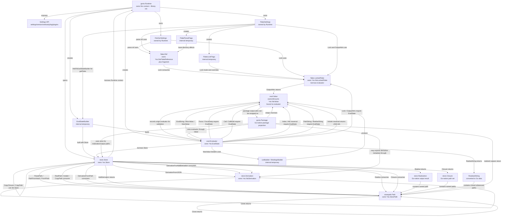
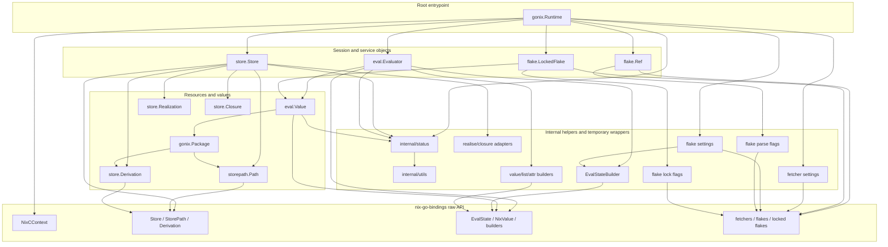

# gonix architecture

`gonix` is a high-level Go SDK for Nix. It wraps
`github.com/sund3RRR/nix-go-bindings`, which is the generated, low-level bridge
to the Nix C API.

The SDK goal is to expose Nix through Go-native APIs: runtime initialization,
settings, stores, store paths, derivations, evaluation states, values, flakes,
realized outputs, closures, ownership-safe resource lifecycle, and structured
errors.

## Boundary with nix-go-bindings

`nix-go-bindings` is the only direct portal to Nix. It exposes raw opaque types
and raw lifecycle functions. `gonix` should wrap those resources before they
cross a public API boundary.

The public SDK should not:

- duplicate generated bindings;
- expose generated `.Free()` helpers as public API;
- call private Nix C++ APIs directly;
- add ad hoc cgo calls around missing bindings;
- shell out to the `nix` CLI for core SDK behavior.

Shelling out is acceptable for tests, diagnostics, and compatibility checks.

Use API-specific free functions instead of generated `.Free()` methods:
`StoreFree`, `StorePathFree`, `DerivationFree`, `StateFree`, `ValueDecref`,
`FlakeReferenceFree`, `LockedFlakeFree`, and similar functions from
`nix-go-bindings`.

Callback-heavy APIs are out of scope for v1 unless a safe `cgo.Handle` registry
and lifetime model is designed. This includes custom primops, external value
callback descriptors, raw store callbacks, and arbitrary GC finalizers.

## Entrypoint model

The selected v1 bootstrap entrypoint is `gonix.Runtime`, with `gonix.Client`
providing higher-level flake and package workflows.

`Runtime` initializes Nix, owns the Nix C context, applies settings, and creates
high-level objects such as stores and evaluators. `Client` borrows a
runtime, owns the store/evaluator used for workflow helpers, and creates flake
references, locked flakes, and package projections.

This gives users one clear bootstrap object without turning the root package
into a large proxy facade.

### Runtime responsibilities

- Create and free `nix_c_context`.
- Initialize selected Nix libraries.
- Apply process/global settings, verbosity, and log format.
- Open stores.
- Create evaluators.
- Own fetcher and flake settings for flake APIs.
- Track resources created through the runtime and close them in reverse order.

### Client responsibilities

- Borrow an initialized runtime.
- Open the store and evaluator used for high-level workflows.
- Parse and lock flakes.
- Fetch package-shaped values from locked flakes through embedded projections.
- Track resources created through the client and close them in reverse order.

### Runtime lifetime

The runtime must outlive every object it creates or helps construct:

- `store.Store`
- `storepath.Path`
- `store.Derivation`
- `eval.Evaluator`
- `eval.Value`
- `fetchers.Settings`
- `flake.Ref`
- `flake.LockedFlake`
- `gonix.Client`

Closing the runtime ends the object graph. Child objects should reject use after
close with `status.ErrClosed` wrapped by the public method that detected it.

### Concurrency

One `Runtime` is one execution stream. Public wrappers are not goroutine-safe
unless a type explicitly documents otherwise.

Parallel Nix work should use separate `Runtime` instances, each with its own
stores, evaluators, and values. This keeps the API honest about mutable Nix
contexts and eval states and avoids hidden locking semantics in v1.

## Package layout

Packages are split by ownership boundary and dependency direction, not by every
Nix noun.

| Go package | Public abstractions | Responsibility |
| --- | --- | --- |
| `gonix` | `Runtime`, `Client`, `Package`, root error aliases, runtime/client options | SDK entrypoints, Nix initialization, settings, flake/package workflows, resource tracking. |
| `storepath` | `Path` | Independent owned wrapper for `*nix.StorePath`. Does not depend on `store`. |
| `store` | `Store`, `Derivation`, `Realization`, `Closure` | Store-backed workflows: store metadata, path parsing, derivations, realization, closure traversal, copying. |
| `eval` | `Evaluator`, `Value`, `ValueType`, builders, realized strings | Evaluation state and values. `Value` lives here because many value operations require an `EvalState`. |
| `fetchers` | `Settings` | Fetcher settings lifecycle for APIs that fetch or parse flake inputs. |
| `flake` | `Settings`, `Ref`, `LockedFlake`, parse and lock options | Flake settings lifecycle, flake references, locking, and locked output access. |
| `internal/status` | `NixError`, `ErrorCode`, `ErrClosed` | Conversion from mutable Nix context errors into stable Go errors. |
| `internal/utils` | C string and small raw adapters | Shared implementation details for wrappers. |

Import direction must stay one-way:

- root `gonix` may import `store`, `storepath`, `eval`, `fetchers`, and `flake`;
- `store` may import `storepath`;
- `eval` may import `store` and `storepath`;
- `fetchers` imports no public gonix sibling packages;
- `flake` may import `eval`;
- subpackages must not import root `gonix`.

## Public call boundaries

Public workflow methods should accept and return high-level wrappers:
`*storepath.Path`, `*store.Store`, `*store.Derivation`, `*eval.Value`, and so
on.

Low-level constructors may accept raw pointers only when they are integration
points between sibling packages or tests. For example, `storepath.New(ctx, ptr)`
accepts a raw Nix context plus an owned raw `*nix.StorePath`.

Do not expose raw `*nix.EvalState` in public value APIs. In v1,
state-dependent value operations should be methods on `*eval.Evaluator`, such
as `Evaluator.Force(value)` or `Evaluator.Attr(value, name)`.

## Core abstractions

| Abstraction | Owns | Borrows or depends on | Public inputs |
| --- | --- | --- | --- |
| `gonix.Runtime` | `*nix.NixCContext`, process settings, fetcher/flake settings | nothing above it | runtime options, store URIs, high-level option structs |
| `gonix.Client` | workflow store, evaluator, package projection, created flake refs and locks | `gonix.Runtime` | client options, flake refs, package names |
| `store.Store` | `*nix.Store` | runtime context | `*storepath.Path`, `*store.Derivation`, store options |
| `storepath.Path` | `*nix.StorePath` | Nix context for error-producing methods | no `Store`; raw pointer only through `New` and `Borrow` escape hatches |
| `store.Derivation` | `*nix.NixDerivation` | runtime/store context for JSON and store operations | JSON strings, cloned derivations |
| `eval.Evaluator` | `*nix.EvalState` | `*store.Store`, runtime context | `*eval.Value` for state-dependent value operations |
| `eval.Value` | `*nix.NixValue` reference | evaluator identity and context | state-independent getters only; state-dependent operations go through `Evaluator` |
| `fetchers.Settings` | `*nix.NixFetchersSettings` | runtime context | raw pointer only through `Borrow` escape hatch |
| `flake.Settings` | `*nix.NixFlakeSettings` | runtime context | raw pointer only through `Borrow` escape hatch |
| `flake.Ref` | `*nix.NixFlakeReference`, fragment string | fetcher/flake settings context | parse options, input override paths |
| `flake.LockedFlake` | `*nix.NixLockedFlake` | `*eval.Evaluator`, flake settings | lock options, `*flake.Ref`; returns `*eval.Value` outputs |
| `gonix.Package` | no raw Nix object | decoded package projection | package fields and metadata |

### Runtime

Typical creation surface:

- `gonix.NewRuntime(opts ...Option) (*Runtime, error)`
- `Runtime.Close() error`
- `Runtime.OpenStore(uri string, opts ...store.Option) (*store.Store, error)`
- `Runtime.NewEvaluator(store *store.Store, opts ...eval.Option) (*eval.Evaluator, error)`

Runtime methods should stop at bootstrapping and composition. Store operations
belong on `store.Store`; value operations belong on `eval.Evaluator` or
`eval.Value`; high-level flake and package workflows belong on `Client`.

### Client

Typical creation and workflow surface:

- `gonix.NewClient(runtime *Runtime, opts ...ClientOption) (*Client, error)`
- `Client.Close() error`
- `Client.ParseFlakeRef(ref string, opts ...flake.ParseOption) (*flake.Ref, error)`
- `Client.LockFlake(ref *flake.Ref, opts ...flake.LockOption) (*flake.LockedFlake, error)`
- `Client.FetchPackage(locked *flake.LockedFlake, name string, opts ...FetchPackageOption) (Package, error)`
- `Client.DownloadPackage(locked *flake.LockedFlake, name string, opts ...DownloadPackageOption) ([]DownloadedPackageOutput, error)`

Client methods own the workflow resources they create and require the borrowed
runtime to outlive the client.

### Store

`store.Store` owns a raw `*nix.Store` and borrows the runtime context.

Store creation:

- `Runtime.OpenStore(uri string, opts ...store.Option)`
- package-level constructors for internal integration when a raw handle is
  already owned.

Core methods:

- metadata: `URI`, `StoreDir`, `Version`;
- paths: `ParsePath`, `PathFromHash`, `PrintPath`, `RealPath`, `IsValidPath`;
- derivations: `DerivationFromJSON`, `DerivationFromPath`, `AddDerivation`;
- realization: `Realise`;
- closure: `Closure(path, opts...)`, `CopyClosure`;
- copying: `CopyPathTo(dst, path, opts...)`.

`Closure` options expose Nix's closure traversal flags: reverse traversal,
including outputs, and including derivers. `CopyPathTo` options expose repair
and signature-check flags.

`Store` creates many `storepath.Path` and `store.Derivation` wrappers. Returned
wrappers own their raw resources and must be closed independently unless they
are tracked by a parent object that documents otherwise.

### StorePath

`storepath.Path` is an owned Nix store path handle.

Creation paths:

- `Store.ParsePath`;
- `Path.Clone`;
- `Store.PathFromHash`;
- `storepath.FromParts`;
- `Store.AddDerivation`;
- closure and realization result conversion.

Core methods:

- `Name() (string, error)`;
- `Hash() ([20]byte, error)`;
- `Borrow() (*nix.StorePath, error)`;
- `Clone() (*storepath.Path, error)`;
- `Close() error`.

`Path` intentionally has no `String` or `RealPath` method. Formatting a full
store path depends on `Store`, and `storepath` must not depend on `store`.

### Derivation

`store.Derivation` owns a raw `*nix.NixDerivation`.

It lives in the `store` package for v1 because importing, exporting, querying,
and adding derivations are store-backed workflows.

Creation paths:

- `Store.DerivationFromJSON`;
- `Store.DerivationFromPath`;
- `Derivation.Clone`.

Core methods:

- `JSON() (string, error)`;
- `Clone() (*Derivation, error)`;
- `Borrow() (*nix.NixDerivation, error)`;
- `Close() error`.

`Store.AddDerivation(derivation)` returns an owned `*storepath.Path`.

### Evaluator

`eval.Evaluator` owns a raw `*nix.EvalState` and borrows a `store.Store` plus
the runtime context.

Creation:

- `Runtime.NewEvaluator(store *store.Store, opts ...eval.Option)`;
- package-level construction for integration when a caller already owns the
  context.

`eval.Options` should include lookup path entries and feature toggles needed by
the eval-state builder.

Core methods:

- `EvalString(expr, path string) (*eval.Value, error)`;
- `NewValue(v eval.GoValue) (*eval.Value, error)`;
- `Force(value)`;
- `ForceDeep(value)`;
- `Call(fn, arg)`;
- `CallMulti(fn, args...)`;
- `Index(value, i)`;
- `Attr(value, name)`;
- `RealiseString(value)`;
- `Unmarshal(value, out)`;
- `Close() error`.

`Evaluator` creates `Value` wrappers. Values are tied to the evaluator because
forcing, calls, list traversal, attr traversal, path strings, and realized
strings require an `EvalState`.

An evaluator tracks values it creates and closes any still-open values before
freeing its `EvalState`. Calling `Value.Close` directly remains valid and
idempotent; the evaluator's later cleanup observes the already-closed value.

### Value

`eval.Value` wraps an owned or refcounted `*nix.NixValue`.

The raw value handle is not enough for many useful operations. Nix requires the
`EvalState` for forcing, function calls, list and attrset traversal,
path-string initialization and getters, and realized strings.

Decision for v1:

- keep `Evaluator` and `Value` in the same package;
- implement state-dependent operations as methods on `*eval.Evaluator`;
- store unexported origin metadata in `Value` so evaluator methods can reject
  values from a different evaluator;
- do not accept raw `*nix.EvalState` in public APIs.

Value methods:

- `Type() (ValueType, error)`;
- `TypeName() (string, error)`;
- primitive getters such as `Bool`, `Int`, `Float`, and `String`;
- `Borrow() (*nix.NixValue, error)`;
- `Close() error`.

`Evaluator.WrapValue(ptr)` is a narrow sibling-package integration point for
adopting owned raw values returned by Nix APIs, such as locked flake output
attrs. Ordinary user code should not need it.

`Value.Close` should call `ValueDecref`. Values returned by list and attr
lookups should be treated as owned references unless upstream ownership proves
otherwise.

`Evaluator.Unmarshal(value, out)` decodes Nix values into Go structs and other
supported Go values using `nix` field tags and `validate:"required"` markers.
It is an evaluator method because attr and list traversal require the owning
`EvalState`. Extra Nix attrs are ignored; missing optional attrs leave their Go
fields unchanged.

### Realization and Closure

Realization and closure results should be Go-native result structs, not
long-lived raw wrappers.

```go
type Realization struct {
	OutputName string
	Path       *storepath.Path
}

type Closure struct {
	Paths []*storepath.Path
}
```

`Store.Realise` converts raw realization results into `[]Realization`, clones
paths as owned `storepath.Path` wrappers, and frees the raw result handle before
returning. Each `Realization` owns its `Path` and provides `Close() error`.

`Store.Closure` converts raw `StorePathArray` handles into owned paths and frees
the raw array before returning. `Closure.Close()` releases every owned path and
is idempotent.

Closure traversal is configured with:

- `WithClosureReverse`;
- `WithClosureOutputs`;
- `WithClosureDerivers`.

Path copying is configured with:

- `WithCopyRepair`;
- `WithCopyCheckSignatures`.

### Flakes

Flake APIs need runtime-owned fetcher settings, runtime-owned flake settings,
an evaluator, and often a store.

Creation:

- `Client.ParseFlakeRef(ref string, opts ...flake.ParseOption) (*flake.Ref, error)`
- `Client.LockFlake(ref *flake.Ref, opts ...flake.LockOption) (*flake.LockedFlake, error)`

`flake.Ref` owns a raw `*nix.NixFlakeReference` and stores the parsed fragment
as a Go string.

`flake.LockedFlake` owns a raw `*nix.NixLockedFlake` and borrows the runtime
context, `eval.Evaluator`, and flake settings.

The main v1 method can be:

- `OutputAttrs() (*eval.Value, error)`

Higher-level traversal should build on `Evaluator.Attr(value, name)` or
`Client.FetchPackage`. Store-backed package realization should build on
`Client.DownloadPackage` when callers want pure Go output DTOs.

### Package

`gonix.Package` is a decoded convenience shape, not a raw Nix C concept.

Expected shape:

- is produced by `Client.FetchPackage`;
- contains Go-native package fields, output metadata, source metadata, and
  normalized nixpkgs `meta` fields;
- does not own or borrow raw Nix values.

`Client.DownloadPackage` realizes every package output through the client store
and returns `[]DownloadedPackageOutput`. Those result values are pure Go DTOs:
they contain the output name, logical store path, real filesystem path, store
path name, and hash, but do not own Nix resources and do not need to be closed.

## Dependency graph

Edges describe ownership, factory calls, or required state.



## Layer diagram

The API is layered from user-facing orchestration down to raw bindings.



## Ownership table

| gonix type | Raw object | Ownership | Close operation |
| --- | --- | --- | --- |
| `gonix.Runtime` | `*nix.NixCContext` | owned | `CContextFree` |
| `store.Store` | `*nix.Store` | owned, borrows runtime context | `StoreFree` |
| `storepath.Path` | `*nix.StorePath` | owned or cloned before public return | `StorePathFree` |
| `store.Derivation` | `*nix.NixDerivation` | owned or cloned | `DerivationFree` |
| `eval.Evaluator` | `*nix.EvalState` | owned, borrows `store.Store` | `StateFree` |
| `eval.Value` | `*nix.NixValue` | owned/refcounted, tied to an evaluator | `ValueDecref` |
| list/attr builders | raw builders | internal temporary | matching builder free function |
| realized strings | `*nix.NixRealisedString` | internal temporary | `RealisedStringFree` |
| `fetchers.Settings` | `*nix.NixFetchersSettings` | owned, borrows runtime context | `FetchersSettingsFree` |
| `flake.Settings` | `*nix.NixFlakeSettings` | owned, borrows runtime context | `FlakeSettingsFree` |
| `flake.Ref` | `*nix.NixFlakeReference` | owned | `FlakeReferenceFree` |
| `flake.LockedFlake` | `*nix.NixLockedFlake` | owned, borrows `eval.Evaluator` | `LockedFlakeFree` |
| `gonix.Package` | none directly | decoded package projection | no raw free |

Every owned wrapper must implement idempotent `Close() error`. Public operations
after `Close` should return a wrapped `status.ErrClosed`.

When a raw free function does not accept a Nix context and does not return a
status code, `Close` should not inspect the wrapper's borrowed context after
freeing. This keeps late idempotent cleanup from touching a context that may
already have been released by `Runtime.Close`.

Borrowed raw pointers may be exposed only through narrow, documented escape
hatches such as `Borrow`. Callers must not free borrowed pointers and must not
retain them beyond the immediate raw call.

## Error handling

All public methods should return Go `error` values when failure is possible.

Rules:

- Check every raw call that returns `nix.NixErr`.
- Convert raw context errors through `status.FromContext`.
- Wrap errors with operation context using `fmt.Errorf("...: %w", err)`.
- Check nil pointers returned by raw APIs and convert the Nix context error.
- For boolean raw calls, distinguish a real `false` result from a context error.
- Convert C-owned strings to Go strings immediately with `utils.TakeCString`.
- Convert raw result handles into Go structs/slices immediately, then free the
  raw handle before returning.

## File layout

Expected layout for v1:

| Path | Contents |
| --- | --- |
| `errors.go` | Public aliases for structured errors and `ErrClosed`. |
| `runtime.go`, `runtime_config.go`, `runtime_options.go` | `Runtime`, initialization, settings, verbosity, log format, typed runtime options. |
| `storepath/path.go` | `storepath.Path`, constructors, metadata, clone, borrow, close. |
| `store/store.go` | `store.Store`, open options, metadata, path operations, copy operations. |
| `store/derivation.go` | `store.Derivation` and store-backed derivation workflows. |
| `store/realization.go` | `store.Realization`, `store.Closure`, raw result conversion. |
| `eval/evaluator.go` | `eval.Evaluator`, options, eval-state builder integration. |
| `eval/value.go` | `eval.Value`, `ValueType`, primitive getters, ownership, borrow. |
| `eval/ops.go` | State-dependent value operations as `Evaluator` methods. |
| `eval/builders.go` | Go-to-Nix values, list builders, attr builders. |
| `eval/unmarshal.go` | Nix value to Go reflection decoder. |
| `eval/realised_string.go` | Realized string conversion and referenced path cloning. |
| `fetchers/settings.go` | `fetchers.Settings`, constructors, borrow, close. |
| `flake/settings.go`, `flake/ref.go`, `flake/lock.go` | Flake settings, flake references, parse options, lock options, locked output attrs. |
| `client.go`, `package.go`, `scripts/projections/package.nix` | Client workflow layer and stable package projection. |
| `internal/status` | Error conversion, error codes, `ErrClosed`. |
| `internal/utils` | C string conversion and small raw adapters. |
