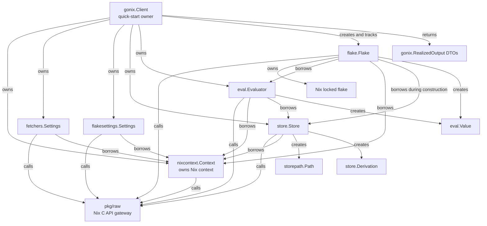

# gonix architecture

`gonix` is a high-level Go SDK over its bundled
`github.com/sund3RRR/gonix/pkg/raw` package, the generated bridge to the Nix C
API and narrow binding-owned adapters.

The SDK has two entry layers:

- `gonix.Client` is the quick-start, flake-first API.
- `nixcontext.Context` plus the public subpackages are the composable advanced
  API.

## Boundary with pkg/raw

`pkg/raw` is the only gateway to Nix. High-level gonix packages must not
duplicate generated bindings, call private Nix C++ APIs, add ad hoc cgo, or
shell out to the `nix` CLI for core SDK behavior.

`pkg/raw` contains the generated Go package, C/C++ shims, generator
configuration, and low-level tests. Its narrow C++ adapters provide
callback-free store results and resolved flake data. Store GC root discovery
and garbage collection return opaque result handles. Flake adapters provide
resolved lock JSON and Nix's locked-flake fingerprint. High-level gonix code
consumes only the generated Go functions and does not depend on private Nix
headers directly.

Raw generated context pointers never cross public constructor boundaries.
Public constructors receive `*nixcontext.Context`. Narrow integration points
may still accept or return another raw generated handle when wrapping an
already-owned Nix object, for example `storepath.New` and `Value.Borrow`.

Every owned wrapper uses the API-specific lifecycle operation:
`StoreFree`, `StorePathFree`, `DerivationFree`, `StateFree`, `ValueDecref`,
`LockedFlakeFree`, and corresponding settings free functions. Temporary flake
references are released during `flake.New`. Generated `.Free()` helpers are not
a substitute for object-specific lifecycle APIs.

## Entrypoint model

### Client quick start

`Client` is the primary user-facing object:

```go
ctx := context.Background()

client, err := gonix.NewClient(gonix.ClientConfig{})
defer client.Close()

f, err := client.OpenFlake("github:NixOS/nixpkgs/nixos-unstable")
defer f.Close()

var pkg struct {
    Name    string `nix:"name"`
    DrvPath string `nix:"drvPath"`
}
err = client.EvalFlakeOutput(
    ctx,
    f,
    []string{"legacyPackages", gonix.DefaultSystem(), "hello"},
    &pkg,
)
outputs, err := client.Realize(ctx, pkg.DrvPath)

var result int
err = client.Eval(ctx, "1 + 2", &result)
```

`ClientConfig{}` is flake-ready. It preserves Nix defaults while enabling
`nix-command` and `flakes` when the caller did not explicitly configure
`experimental-features`.

Client owns:

- one hidden `nixcontext.Context`;
- fetcher and flake settings;
- one default Store and Evaluator.

Every Flake returned by `Client.OpenFlake` may be closed early by the caller.
Client tracks all returned flakes and closes any remaining ones before its
evaluator, store, settings, and context.

`Client.OpenFlakeFromLock` opens the same kind of Client-tracked Flake using a
caller-provided `flake.LockInfo` as Nix's reference lock graph. The root flake
reference still identifies the `flake.nix` and outputs; the lock graph pins the
inputs. This path uses Nix's lock machinery with an in-memory reference lock
file and defaults to check mode so stale lock graphs fail instead of silently
updating.

Client high-level operations accept a `context.Context` and are serialized.
Overlapping use returns `ErrConcurrentUse`. Cancellation requests Nix's
cooperative process interrupt, interrupts active store I/O through a separate
Nix context, waits for the native operation to return, clears the interrupt,
and closes the Client because an interrupted remote store cannot be reused.

`Client.Eval` is the resource-safe convenience path for evaluating a Nix
expression directly into Go data. Advanced callers that need raw values or a
custom diagnostic path use `eval.Evaluator`.

`Client.EvalFlakeOutput` provides the corresponding resource-safe path for
decoding any locked flake output. Attribute paths are represented as string
slices so every element names one exact Nix attribute without parsing or
escaping rules.

`Client.GetFlakeOutputValue` returns the final selected output as a
caller-owned `eval.Value`. Each attribute getter creates an independent Nix
reference, so the method closes intermediate values immediately while the
returned value remains live. `Client.Unmarshal` decodes such a value using the
Client's hidden evaluator.

`Client.Realize` realizes a derivation store path and converts every resulting
store path into a Go-owned `RealizedOutput`.

### Advanced composition

Advanced users create an explicit lifetime root and compose subpackages:

```go
ctx, err := nixcontext.New(nixcontext.Config{})
defer ctx.Close()

s, err := store.New(ctx, "dummy://")
defer s.Close()

e, err := eval.New(ctx, s)
defer e.Close()
```

`nixcontext.Context` creates and initializes libutil, libstore, and libexpr. It
owns only the raw Nix context and does not track children. Every child must be
closed before its Context.

The `flake.New` constructor is an advanced composition point. `flake.NewFromLock`
adds the same composition path with a caller-provided `LockInfo` reference lock.
All arguments must belong to the same object graph. Store and fetcher settings
are borrowed only during construction; Context, flake settings, and Evaluator
must outlive raw operations on the returned Flake.

During construction, `flake.New` decodes and caches Nix-normalized lock metadata
and Nix's optional locked-flake fingerprint. Lock graph access never re-locks, reads
`flake.lock`, shells out, or evaluates a projection. The typed graph preserves
fetcher-specific reference attributes as raw JSON so the stable gonix schema
does not duplicate every Nix input scheme.

## Configuration

`ClientConfig` uses zero values as “not configured”:

- false booleans, zero integers, empty strings, and empty slices do not replace
  Nix defaults;
- exact false/zero values and `max-jobs=auto` use `RawSettings`;
- typed settings are serialized first and `RawSettings` wins conflicts;
- list settings are copied, split on whitespace, deduplicated, sorted, and
  joined with spaces;
- `experimental-features` is applied before other settings;
- verbosity is applied only when it is not `VerbosityDefault`;
- log format is applied only when non-empty.

Client always installs its flake settings into the evaluator builder after user
evaluator options. This provides Nix flake evaluator integration including
`builtins.getFlake`.

General context settings live on `nixcontext.Context`, not Client:

- `Setting`;
- `SetSetting`;
- `SetVerbosity`;
- `SetLogFormat`.

## Package boundaries

| Package | Public abstractions | Responsibility |
| --- | --- | --- |
| `gonix` | `Client`, `ClientConfig`, `RealizedOutput` | High-level evaluation, flake opening, realization, and resource orchestration. |
| `pkg/raw` | Generated Nix C API types and functions | Sole low-level Nix boundary, C/C++ shims, and generated bindings. |
| `nixcontext` | `Context`, `Config`, verbosity and log types | Nix context bootstrap, settings, raw context lifecycle. |
| `storepath` | `Path` | Owned Nix store path handles. |
| `store` | `Store`, `Derivation`, `DerivationData`, `Realization`, `Closure`, `GCRoot`, `GCResult` | Store-backed paths, derivations, realization, closures, GC roots and collection, and copying. |
| `eval` | `Evaluator`, `Value`, builders, realized strings | Evaluation states and values tied to an evaluator. |
| `fetchers` | `Settings` | Fetcher settings lifecycle. |
| `flakesettings` | `Settings` | Flake settings lifecycle and evaluator integration. |
| `flake` | `Flake`, `LockInfo`, `LockNode`, `LockInput`, `LockReference`, options | Flake parsing, locking, cached lock metadata, fingerprinting, output traversal, and lifecycle. |
| `internal/status` | `NixError`, `ErrorCode`, `ErrClosed` | Stable conversion of mutable Nix context errors. |
| `pkg/utils` | `TakeCString`, `EncodeNix32` | Shared generated-binding and Nix representation adapters. |

Dependency direction is one-way:

- root `gonix` imports `nixcontext` and public subpackages;
- high-level packages may import `pkg/raw`, but `pkg/raw` never imports
  high-level gonix packages;
- public subpackages may import `nixcontext`;
- `store` may import `storepath`;
- `eval` may import `store`, `storepath`, and `flakesettings`;
- `flake` may import `eval`, `fetchers`, `flakesettings`, and `store`;
- subpackages do not import root `gonix`.

## Ownership and lifetimes

| Type | Raw object | Ownership | Close operation |
| --- | --- | --- | --- |
| `nixcontext.Context` | `*raw.NixCContext` | owned lifetime root | `CContextFree` |
| `gonix.Client` | composed resources | owns context, settings, store, evaluator | reverse dependency order |
| `flake.Flake` | `*raw.NixLockedFlake` plus cached fragment, lock graph, and fingerprint | owned; borrows Context, flake settings, and Evaluator; borrows Store and fetcher settings during construction | `LockedFlakeFree` |
| `store.Store` | `*raw.Store` plus cached metadata | owned; borrows Context | `StoreFree` |
| `storepath.Path` | `*raw.StorePath` | owned or cloned | `StorePathFree` |
| `store.Derivation` | `*raw.NixDerivation` plus cached JSON | owned or cloned | `DerivationFree` |
| `eval.Evaluator` | `*raw.EvalState` | owned; borrows Store and Context | `StateFree` |
| `eval.Value` | `*raw.NixValue` | caller-owned/refcounted; tied to Evaluator and borrows Context | `ValueDecref` |
| `fetchers.Settings` | settings handle | owned; borrows Context | `FetchersSettingsFree` |
| `flakesettings.Settings` | settings handle | owned; borrows Context | `FlakeSettingsFree` |



All Close methods are idempotent. Methods depending on a closed owned handle or
closed Context return `status.ErrClosed` directly or wrapped with operation
context. Cached metadata accessors on `store.Store`, `storepath.Path`, and
`flake.Flake`, plus cached serialization on `store.Derivation`, remain available
after their raw handles or Context are closed. Objects are not goroutine-safe
unless explicitly documented.

Caller-owned resources must be closed before the resources they borrow:

- every `flake.Flake` created through advanced composition before its borrowed
  resources; Client-managed flakes may instead be left for `Client.Close`;
- every `eval.Value` before its Context, preferably before its Evaluator.

Closing an Evaluator invalidates operations on its Values. Those Values may
still be closed after the Evaluator while their Context remains open.

Store GC result handles and cloned root paths are temporary implementation
details: gonix converts them to Go strings and frees every native allocation
before returning. `Store.FindRoots` therefore returns `[]GCRoot` with no
lifecycle requirements. Root creation and specific-path collection accept
store path strings and parse temporary `storepath.Path` handles internally.
Garbage collection is unlimited by default, while an explicit zero-byte limit
remains representable through `WithGCMaxFreed(0)`. Ignoring root liveness is
exposed only as an explicit, documented dangerous option.

## Error handling

- Check every raw status code.
- Check every pointer result that can signal failure.
- Convert pending Nix errors immediately with `status.FromContext`.
- Preserve converted errors with `%w`.
- Borrow the `nixcontext.Context` before every raw operation.
- Distinguish a real false result from a pending context error.
- Convert C-owned strings to Go strings immediately and release them.
- Continue closing independent resources after one cleanup error and return
  `errors.Join`.

## Public workflow boundaries

- `Client.OpenFlake` creates a caller-accessible, Client-tracked Flake that may
  be closed early.
- `Client.OpenFlakeFromLock` does the same while using a caller-provided
  `flake.LockInfo` as the reference lock graph for the root flake reference.
- `Client.Eval` evaluates and unmarshals an expression without exposing a raw
  Nix value.
- `Client.Unmarshal` decodes a caller-owned value created by the Client's
  evaluator.
- `flake.New` and `flake.NewFromLock` are the explicitly assembled advanced
  constructors.
- `Flake.LockInfo` and `Flake.Fingerprint` expose cached lock metadata without
  requiring live Nix resources; each `LockInfo` call returns a freshly decoded
  graph whose maps, slices, and raw JSON bytes are caller-owned.
- `Client.EvalFlakeOutput(ctx, flake, path, out)` traverses and unmarshals exact
  locked-output attributes.
- `Client.GetFlakeOutputValue(ctx, flake, path)` returns a caller-owned final
  output value and closes intermediate traversal values.
- `Client.Realize(ctx, drvPath)` realizes a derivation path and returns
  Go-owned output DTOs.
- Package discovery, indexing, and metadata policy stay outside gonix.
